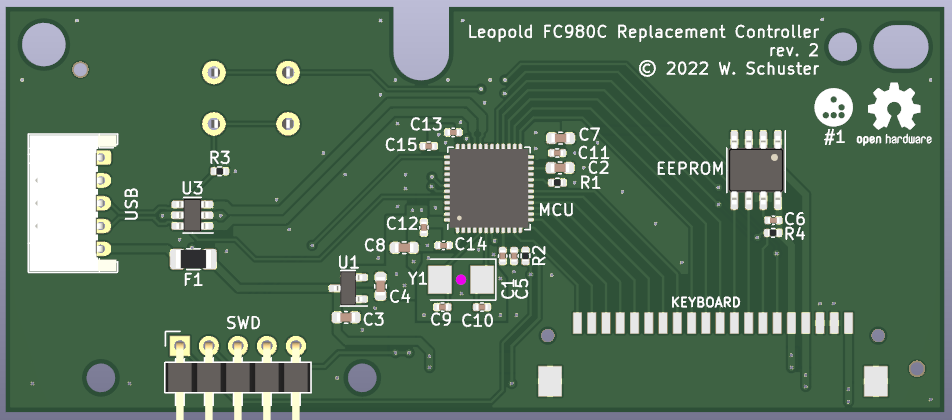
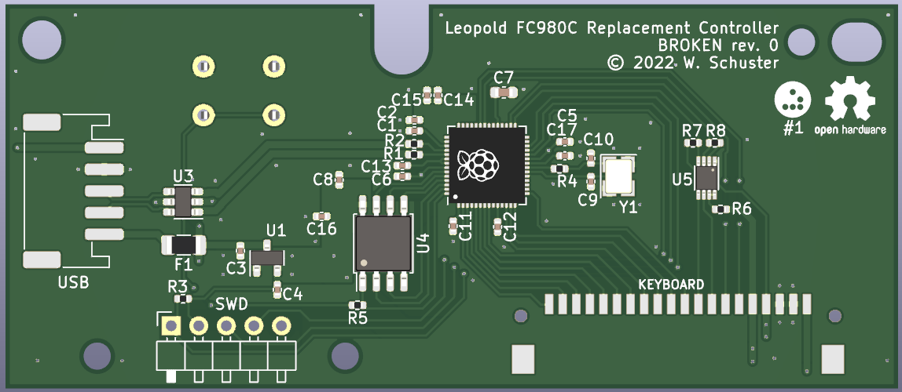

Leopold FC980C Replacement Controller
=====================================

This PCB replaces the controller of the Leopold FC980C keyboard to allow running
alternate firmware, especially open source firmware such as [QMK][QMK]. This
project relies heavily on the prior reverse engineering work done by hasu (aka
tmk) and collaborators.

This is the first PCB I have designed and as such I suspect this will have many
areas that can be improved. I am very much looking forward to hearing feedback
about this design, if you think something can be improved please open an issue
and let me know. I will list my reasons for various design decision below as
well as an errata section to list shortcomings on the current design I am aware
of.

<!-- ![FC980C controller photo][img/rev1-board-shot.png] -->

**Specs:**
- STM32F401 MCU as found on the Blackpill boards
- Open Hardware licensed under CERN OHL-S v2
- designed to be assembled by [JLCPCB][JLC]

**Why would anyone want a replacement keyboard controller for the FC980C?** In
case the original controller fries, the lack of controller replacement from the
manufacturer would otherwise mean tossing the whole (expensive) keyboard. This
also enables the usage of Free and Open Source firmware to replace the
proprietary stock software. Running alternate firmware allows enabling hardware
features not accessible through the original controller such as actuation point
adjustments, not to mention the plethora of software features enabled by QMK
for example.

[QMK]: https://qmk.fm/
[JLC]: https://jlcpcb.com/

Getting started
---------------

If you have received this controller fully assembled, your next step will be
firmware setup (TBD - still waiting on first production run).

In case you still have to solder on the connector, see the assembly section
below.

Assembly
--------

This PCB is intended to be manufactured and assembled by JLCPCB, **except** for
the connectors and a button on the bottom side.

The button (BOOT0) is through-hole and easily soldered by hand. Make sure to
place it on the bottom side, i.e. opposite side of the MCU where the DIP
switches are on the original controller board.

The connector for the USB board (USB) is though-hole and can be hand soldered.

The SWD header is optional and can be left unsoldered.

The connector labeled KEYBOARD is only available for surface mounting and
unfortunately not available at JLC for assembly (at least at the time of
design). Hand soldering is a bit more challenging for this connector. Make sure
to use a healthy dose of flux and fine solder wire.

Production
----------

While the PCB itself can be manufactured by a number of PCB houses, component
selection and SMD assembly is made with [JLCPCB][JLC] in mind. The
`jlcpcb/production_files` folder for each revision should include the necessary
BOM and CPL files in addition to the Gerbers. The board parameters are specified
in the PCB design file (the main parameters being a board thickness of 1.6mm and
2 copper layers). This board is compatible with JLC's "Economic PCBA" option.

The EEPROM (U4) and accompanying decoupling capacitor (C6) are optional. The
board should work without those populated.

[JLC]: https://jlcpcb.com/

Design review
-------------

The specific component selection is tailored to what was available at JLCPCB at
the time of design. While things like the capacitors and resistors can be easily
substituted, Larger ICs such as the USB protection, fuse, 3.3V regulator, MCU,
and I2C level shifter have not been evaluated for alternative parts.

The USB and KEYBOARD connectors interface with the existing connectors used in
the FC980C and cannot be substituted.

I don't intend to sell this controller PCB by myself and as such everyone who is
interested in the design is meant to order this directly from JLC for
themselves. As such, I've tried to minimize cost for low quantity production
runs. JLC has the concept of extended and basic parts where the former incurs a
one-time setup fee per production as those components quire additional labor for
setting up the pick and place machines with the respective components. I've
tried to keep the number of extended components as low as possible.

### MCU

The main requirements for the microcontroller were 5V tolerance and good
compatibility with QMK. Is also tried to take pricing and availability for the
foreseeable future into account. My choice fell on the STM32F401 that is used in
the cheap "Blackpill" development boards and has good QMK support. It is also
already used in [another project][RFR1Replacement] that replaces the controller
and PCB of the Realforce R1 TKL keyboards.

[RFR1Replacement]: https://github.com/Cipulot/RF_R1_8-9Xu

### Protection circuitry

The 5V fuse and USB protection components have been carried forward from the
original RP2040-based design and have been taken from [this][RP2040DesignGuide]
RP2040 design guide.

[RP2040DesignGuide]: https://github.com/Sleepdealr/RP2040-designguide

### USB traces

USB trace width has been calculated using the KiCad built-in calculator
following a [guide on the Digikey blog][DigikeyUSBTraceGuide]. The wide traces
are caused by board design being two layers and having a thickness of 1.6mm.
This is most likely overkill as the bandwidth requirements are very low for a
keyboard. Reviewing a number of other boards, none were using USB-specific trace
widths.

[DigikeyUSBTraceGuide]: https://www.digikey.de/en/maker/projects/how-to-route-differential-pairs-in-kicad-for-usb/45b99011f5d34879ae1831dce1f13e93

Errata
------

### Revision 2

None found thus far.

### Revision 1

The SWD header is unusable since SWDIO has been routed to the wrong pin on the
MCU (PA15 instead of PA13). This has no impact on the on the actual controller
functionality. Fixed in revision 2.

Unfortunately, the `KEY_STATE` pin is missing a 5V pull-up resistor. A manual
fix (such as soldering a 10k resistor between the `KEY_STATE` \[pin 14\] and 5V
on the `KEYBOARD` connector) is necessary. Fixed in revision 2.

Revisions
---------

### Revision 2

Updates SWD pinout to correctly use PA13 on the MCU for SWDIO instead of PA15.

Minor position adjustments to drill holes.

Adds 5V pull-up resistor to `KEY_STATE` line.

Removes I2C level shifter to simplify BOM.

**Sample tested and working:** not yet

### Revision 1

First design that has a chance to actually work in the FC980C. Switch to a
STM32F401 microcontroller. This MCU allows saving a couple of components
compared to the RP2040, such as USB termination resistors and external flash.

One notable addition compared to the previous revision is an optional 64Kb
EEPROM.

**Sample tested and working:** tested and issues identified (see Errata section)

### Revision 0

The first version of this PCB uses a RP2040 controller. Unfortunately, the
FC980C electronics rely on the MCU to be 5V tolerant. I have noticed this fact
while triple checking the design *just* before submitting it for manufacturing.
The RP2040 is *not* 5V tolerant and would require level shifters on many I/O
lines. Because of that I decided to scrap the design and start new, but since
the board design was pretty much complete, I'm including it in this repository
for posterity.

**Sample tested and working:** no

Acknowledgements
----------------

This replacement controller relies heavily on the [prior reverse engineering
work][GeekhackFC980CInvestigation] of the keyboard community, including
uncovering [schematics][FC660CSchematics] for the similar Leopold FC660C that
were submitted to the FCC that helped me figure out the I/O voltage
requirements. In particular, I want to thank hasu (aka tmk) who created a FC980C
replacement controller based on the ATmega32u4 MCU, publishing schematics (but
no design files) and a [open source firmware implementation][TMKFC980C] for tmk
that has been [ported][QMKFC980C] to QMK.

Thanks to Toocanzs#5098 on Discord for helping me with the crystal load capacitor
calculation.

The PCB has been designed using KiCad and production files have been exported
using [Bouni's JLCPCB tools plugin][BouniJLCPlugin].

[GeekhackFC980CInvestigation]: https://geekhack.org/index.php?topic=90681.0
[FC660CSchematics]: https://fccid.io/pdf.php?id=1888185
[TMKFC980C]: https://github.com/tmk/tmk_keyboard/tree/master/keyboard/fc980c
[QMKFC980C]: https://github.com/qmk/qmk_firmware/tree/f21443d6a2be8e2068164f0f3646a175ffed2df4/keyboards/fc980c
[BouniJLCPlugin]: https://github.com/Bouni/kicad-jlcpcb-tools

Resources
---------

These are various resources, that helped me designing my first PCB:

- STM AN4488 - Getting started with STM32F4xxxx MCU hardware development
- [I2C pullup recommendation by adafruit](https://learn.adafruit.com/working-with-i2c-devices/pull-up-resistors),
  [I2C pullup calculator](http://lembke.eu/arduinoablage/20201103i2cpullupcalculator/)
- [I2C Design Mathematics: Capacitance and Resistance](https://www.allaboutcircuits.com/technical-articles/i2c-design-mathematics-capacitance-and-resistance/)
- STM AN2867 - Oscillator design guide for STM8S, STM8A and STM32
  microcontrollers
- [Crystal capacitor guide by adafruit](https://blog.adafruit.com/2012/01/24/choosing-the-right-crystal-and-caps-for-your-design/)
- [STM32 Oscillator Calculator](https://helios.wh2.tu-dresden.de/~benni_koch/stmcalculator/)
- [Crystal Oscillator Design](https://hoani.net/posts/blog/2017-01-19-oscillator-design/)
- [KiCad differential pair routing guide by Digikey](https://www.digikey.de/en/maker/projects/how-to-route-differential-pairs-in-kicad-for-usb/45b99011f5d34879ae1831dce1f13e93)
- [RP2040 hardware design guide by Sleepdealr](https://github.com/Sleepdealr/RP2040-designguide)
- [KiCad 6 STM32 tutorial by Phil's Lab](https://www.youtube.com/watch?v=aVUqaB0IMh4)
- [KiCad PCB tutorial by MalphasWats](https://github.com/MalphasWats/hawk)
- [Layout Design Guide by Toradex](https://docs.toradex.com/102492-layout-design-guide.pdf)
- [Effective PCB Design by NXP](https://www.nxp.com/files-static/training_pdf/WBNR_PCBDESIGN.pdf)

This helped me immensensly in figuring out the FC980C-specific hardware
requirements for the FC980C controller:

- [FC980C pinout by tmk](https://github.com/tmk/tmk_keyboard/blob/4df8a27f7220c5f801f16151d31d4db8e563c2fa/keyboard/fc980c/README.md)
- FC660C [schematic](https://fccid.io/pdf.php?id=1888185) and [BOM](https://fccid.io/pdf.php?id=1888184)

License
-------

Copyright © 2022 Wilhelm Schuster

The PCB design is licensed under the CERN-OHL-S v2. See the LICENSE file in each
of the revision folders for the license text. This license is strongly
reciprocal and is similar in spirit to the GPL, but specifically focuses on
hardware.

The firmware portion of this project is licensed under GPL-2 in accordance with
the QMK project. See the LICENSE file in the firmware folder for the license
text.
